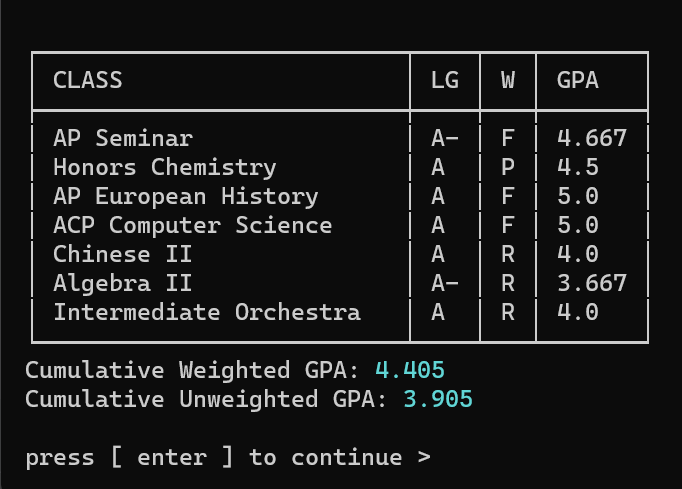

# GPAcalc

## Description

GPAcalc is a simple and easy-to-use command-line based GPA calculator. It allows you to create records (which store class names, grades, and weights) and calculate your GPA based on those records. It also allows you to save existing records to an Excel file. Below is a screenshot showing a current record that has been entered and but not exported yet.

## Instructions

To run, simply clone the program: `git clone https://github.com/knqu/gpacalc.git`, or download the source code and extract it. Then, navigate to the directory and run `pip install -r requirements.txt` to install the required libraries. Finally, run `python gpacalc.py` to start the program.
